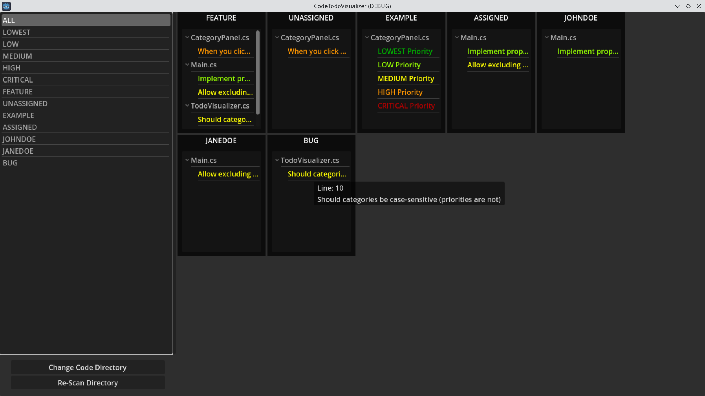

# Code ToDo Visualizer
Code ToDo Visualizer is a program that parses through your code files and looks for ToDo comments. 

## Usage

When you first run Code ToDo Visualizer you will be presented with the Import Settigns screen where you
1. Choose your code directory - This is the root directory of the code files you wish to scan.
2. Choose you language - This enables parsing of a specific language (you can also choose All if you utilize multiple languages)
3. Choose your category delimiter - This is the delimiter used to separate your categories following the syntax above.
4. Press the Import button to recursively scan through the root directory you have set.

After it parses through your files it will display a kanban style board listing the todos by category. You can hover over an item to read the full description (currently limited to the same line the todo is parsed from), as well as display the line number.
You can also click on any of the categories on the left side of the screen to display just the selected category. If you select a priority, only those categories that include a todo with the chosen priority will be displayed.
Clicking on the Import Settings button will take you back to the first screen to change the saved options.
Make any changes, but don't want to re-open the program? Just click the Re-Scan Directory button to parse your directory again.

## Syntax
The syntax it looks for is 

    // TODO(CATEGORY1|CATEGORY2|...): I need to do this
    
where '//' is the selected language's comment syntax and within the ()'s you can have any number of categories separated by '|', '-', '_' or ','.
The TODO is not case-sensitive, but the categories are (meaning THIS and this will be recognized as different categories).

## Priorities
You can also use predefined priorities as a category, included priorities are (not case-sensitive):
1. LOWEST
2. LOW
3. MEDIUM (used as the default if one isn't specified)
4. HIGH
5. CRITICAL